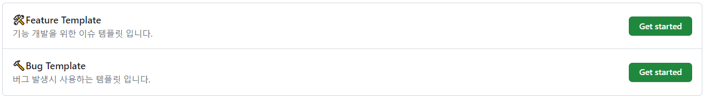

# Frontend

큐시즘 28기 기업프로젝트 HDmedi - 홈페이지 개선

## 📢개발팀 행동 강령📢

### 커밋 컨벤션

커밋 메세지는 **[이슈번호, 기능 키워드, 커밋 내용]**으로 작성할 것!

Ex) `git commit -m "#8 feat : 앱 설치 플로팅 배너 추가 `

- `feat`: 새로운 기능 추가
- `fix`: 버그 수정
- `chore`: 빌드 업무, 패키지 매니저, 라이브러리, dependencies 설정
- `docs`: 문서 수정 Ex) README.md
- `design`: 사용자 UI 디자인 변경 Ex) CSS
- `style`: 기능 수정 없는 코드 스타일 변경
- `refactor`: 코드 리팩터링
- `test`: 테스트 코드, 리펙토링 테스트 코드 추가
- `ci`: ci 설정 파일 수정
- `perf`: 성능 개선
- `rename`: 파일 혹은 폴더명 변경

### Git Flow 전략

- `main` : 출시 가능한 프로덕션 코드의 브랜치
  - `Tag`를 이용하여 배포 버전 명시
- `develop` : 다음 버전을 개발하는 브랜치
- `feature` : 기능을 개발하는 브랜치
  - `feature/이슈번호`로 네이밍 할 것
  - main 또는 develop으로 merge할 때는 `--no-ff` 반드시 사용할 것
- `hotfix` : 출시 버전에서 발생한 버그를 수정 하는 브랜치

### Issue 템플릿 및 라벨

#### 이슈 템플릿 : 이슈 생성시 목적에 맞는 템플릿을 사용합니다 (추가 예정)

#### 이슈 라벨 : 이슈를 분류할 때 라벨을 추가합니다:

- `🛠feat`: 기능 개발을 할 때는 이 라벨을 사용합니다.
- `🔨bug`: 버그를 수정할 때는 이 라벨을 사용합니다.
- `📃docs`: 문서 작업이 필요할 때는 이 라벨을 사용합니다.
- `✅test`: 테스트 관련 이슈는 이 라벨을 사용합니다.
- `⚙chore`: 설정 또는 패키지 매니징에는 이 라벨을 사용합니다.
- `♻refactor`: 리팩터링이 필요할 때는 이 라벨을 사용합니다.

### Pull Request 템플릿 - 추가

### 작업 방식

1. `main` → `develop` 분기
   - 최신 배포 직후에는 `main`과 `develop` 변경 사항이 동일함
2. `develop` → `feature/{기능 이름}` 분기
3. 작업 후 `feature` → `develop` PR
   1. 충돌 해결 및 테스트 코드 pass 확인 (CI)
4. 코드 리뷰 진행
   1. 최소 1번
5. `feature` → `develop` Merge
   1. Squash and Merge
   2. merge 후 `featrue` 브랜치 자동 삭제
6. 배포 시점에 `develop` → `main` PR 및 Merge
   1. Merge commit or Rebase and Merge
   2. CI/CD 작동
7. 애플리케이션 장애가 발생하면 `main` → `hotfix/{문제상황}` 브랜치로 분기
   1. 버그를 고치고 `main`으로 merge
