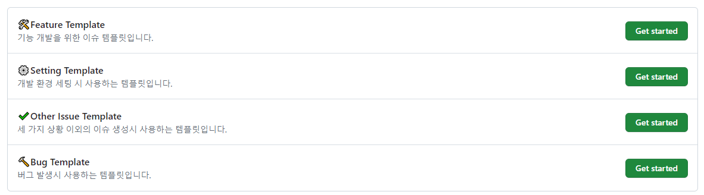

# Frontend

큐시즘 28기 기업프로젝트 HDmedi - 홈페이지 개선

## 📢개발팀 행동 강령📢

### 📕 커밋 컨벤션

커밋 메세지는 <b>[기능 키워드(이슈번호) : 커밋 내용]</b>으로 작성할 것!

Ex) `git commit -m "feat(#8) : 앱 설치 플로팅 배너 추가" `

- `feat` : 새로운 기능 추가
- `fix` : 버그 수정
- `chore` : 빌드 업무, 패키지 매니저, 라이브러리, dependencies 설정
- `docs` : 문서 수정 - <i>README.md, .github, ..etc</i>
- `design` : 사용자 UI 디자인 변경 - <i> CSS</i>
- `style` : 기능 수정 없는 코드 스타일 변경
- `refactor` : 코드 리팩터링
- `test` : 테스트 코드, 리펙토링 테스트 코드 추가
- `ci` : ci 설정 파일 수정
- `perf` : 성능 개선
- `rename` : 파일 혹은 폴더명 변경

 

### 📙 Git Flow 전략

- `main` : 출시 가능한 프로덕션 코드의 브랜치
- `develop` : 다음 버전을 개발하는 브랜치
- `feature` : 기능을 개발하는 브랜치
- `hotfix` : 출시 버전에서 발생한 버그를 수정하는 브랜치

 

### 📒 Issue 템플릿 및 라벨

#### 이슈 템플릿 : 이슈 생성시 목적에 맞는 템플릿을 사용합시다.

#### 이슈 라벨 : 이슈를 분류할 때 라벨을 추가합니다:

- `🛠Feat` : 기능 개발을 할 때는 이 라벨을 사용합니다.
- `🔨Bug` : 버그를 수정할 때는 이 라벨을 사용합니다.
- `⚙Chore` : 설정 또는 패키지 매니징에는 이 라벨을 사용합니다.
- `📃Docs` : 문서 작업이 필요할 때는 이 라벨을 사용합니다.
- `✅Test` : 테스트 관련 이슈는 이 라벨을 사용합니다.
- `♻Refactor` : 리팩터링이 필요할 때는 이 라벨을 사용합니다.

 

### 📗 Pull Request 템플릿

Pull Request Title  : <b>[기능 키워드(이슈번호) : 작업 내용]</b>
- 작업 내용, 작업 사항, 변경 로직 등 명시

 

### 📘 작업 방식 

1. `main` → `develop` 브랜치
   - 최신 배포 직후에는 `main`과 `develop` 변경 사항이 동일함
   - `Tag`를 이용하여 Release 버전 명시
2. `develop` → `feat/개발 내용` 브랜치
3. 작업 후 `feat/개발 내용` → `develop` PR

   - 충돌 해결 및 테스트 코드 pass 확인 (CI)

4. 코드 리뷰 진행
   - 최소 1번
5. `feat/개발 내용` → `develop` Merge
   - Squash and Merge 또는 `--no-ff`
   - merge 후 `feat/개발 내용` 브랜치 삭제하기
6. 배포 시점에 `develop` → `main` PR 및 Merge
   - Merge commit or Rebase and Merge
   - CI/CD 작동
7. 애플리케이션 장애가 발생하면 `main` → `hotfix/{문제상황}` 브랜치로 분기
   - 버그 수정 후 `main`으로 merge
